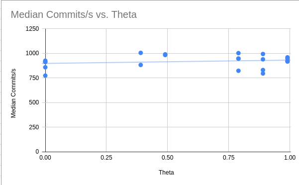

# Results

## Final throughput numbers

1 client and 1 server:

```
node0 median 2841 op/s
node0 median 937 (lead) commits/s
node0 median 5 (lead) aborts/s

total 2841 op/s
total 937 commits/s
total 5 aborts/s
```

2 clients and 2 servers:

```
node0 median 1016 op/s
node0 median 351 (lead) commits/s
node0 median 2 (lead) aborts/s
node1 median 1097 op/s
node1 median 0 (lead) commits/s
node1 median 0 (lead) aborts/s

total 2112 op/s
total 351 commits/s
total 2 aborts/s
```

Having multiple servers/participants likely raises the overhead of commits and aborts, as each commit and abort is always sent to every server.

## Scaling characteristics 

## Analysis on the effects of contention

The following is an image of contention affecting our algorithm.
The 2 clients and 2 servers behavior is similar, but reflects the lower commits and aborts count.



## Payments workload results

We tested our code for strict serializability using a "payments" workload. The goal is to have un-changing total balance across the transactions, which we achieved. Sample results from `./run-cluster.sh 1 1 "" "-connections 10 -payments true"` can be seen below:

```
hosts [node0:8080]
theta 0.99
workload YCSB-B
secs 30
connections 10
...
Payments: accounts initialized; starting transfers.
Audit OK: total=10000 balances=[500 1500 1000 1000 1000 1000 1000 1000 1000 1000]
...
Audit OK: total=10000 balances=[500 700 2400 0 1800 900 1700 100 1700 200]
...
Audit OK: total=10000 balances=[700 1800 800 800 500 2300 0 500 800 1800]
...
Audit OK: total=10000 balances=[2800 2000 0 0 100 2600 1100 200 0 1200]
```

# Design

- One transaction operation is one message to one server
- When necessary, grab locks like a typical 2PL implementation (escalate from RLocks to WLocks with an added dependency)
- Each op message responds with either a deadlock error (implicit "vote no" for 2PC) or a valid result (implicit "vote yes")
- "Prepare" messages as part of 2PC are not incorporated
- Once each operation has been processed, each participant is sent a commit or abort message, according to typical 2PC
- Participants commit or abort accordingly (and the "lead" counts the commit or abort in internal statistics)

## Successful Ideas

- 2PC was reduced in terms of complexity immensely by considering "implicit" prepare stages.
- 2PL with global lock management

## Failed Ideas

- Less failed, but rejected: 2PC with an explicit prepare/voting stage
- Currently involved: broadcasting commit or abort messages to every server may increase overhead

## On Serializability

For a kind of pseudo-proof, consider the fact that serializable systems
are such that the precedence graphs of possible transaction schedules are acyclic.
That is to say that when considering transactions `T1` and `T2`,
it should never be the case that `T1` touches an element `A`, then `T2` touches it,
and `T1` touches it again in an interleaved schedule.

Without loss of generality consider a single server participant
executing `T1` and `T2` (which, again, both "touch" `A`).
If `T1` has factually touched `A`, with its associated lock free for pick up,
it logically "picks up" the lock for `A`. This is apparent in both the server's
`Put` and `Get` methods.
Then, when `T2` tries to touch `A`,
it is either the case that `T1` still has the lock and `T2` aborts,
or `T1` has finished and the lock is available for `T2` to pick up- indicating that `T1` has finished.
This former behavior is due to our 2PL implementation, and the latter
as part of our 2PC implementation.

So, we can see that the scheduling of `T1` and `T2` cannot have cyclic precedence graphs,
and our system is serializable.

# Reproducibility
Our experiments were done on 4 CloudLab m510 machines.

Run `./run-cluster.sh <server_count> <client_count> <server_flags> <client_flags>`, where `client_flags` can include `-connections <#>` and `-payments <true/false>`.

For example:

`./run-cluster.sh 1 1 "" "-connections 10 -payments true"`

Runs the "payments" workload testing the correctness of our 2PC/2PL approach.

`-connections` is how many goroutines each client machine runs. For optimal performance we suggest doing an exponential grid search followed by linear finetuning.

`-payments true` runs a special payments workload as described in assignment.

# Reflections

When attempting to achieve higher performance via client-side multithreading, adding additional routines did not produce expected performance improvement. This is due to lock contention and 2PC aborts for higher number of clients, which is expected. 

Individual contributions from each team member:

- Artem: Initial "start" for serializable single server, bugfixing
- Ash: 2PC (initial ideas, can see in branch `pa2-2pc`), debugging, removed count duplication, throughput analysis
- Brendon: Client interaction code, 2PL, 2PC
- Cayden: N/A (life happens)
